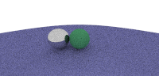

Yet Another Geometric Tool

---

[David Eberly的Geomentric Tool](https://www.geometrictools.com/index.html)库融合了计算几何，计算机图形学和图形学API等众多算法和知识。本工程旨在使用纯Rust仿写Geomentric Tool，用于学习这些知识点并创造一些便于之后使用的代码。

这个分支在编写光线追踪渲染器

