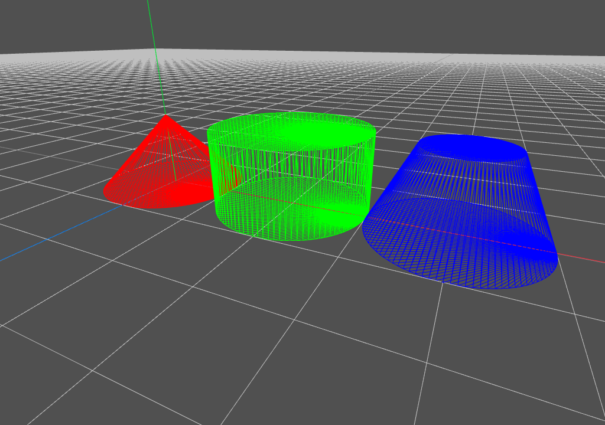

Yet Another Geometric Tool

---

[David Eberly的Geomentric Tool](https://www.geometrictools.com/index.html)库融合了计算几何，计算机图形学和图形学API等众多算法和知识。本工程旨在使用纯Rust仿写Geomentric Tool，用于学习这些知识点并创造一些便于之后使用的代码。

## 目前的进度

* :o: : 编写完成，未测试
* :heavy_check_mark: : 编写完成，测试通过
* :no_entry_sign: : 无需完成

### 网格体生成

|Cylinder|TruncatedCone|Cone|Polygon|Ellipse|Parabola|Hyperbola|
|:------:|:-----------:|:--:|:-----:|:-----:|:------:|:-------:|
|:heavy_check_mark:|:heavy_check_mark:|:heavy_check_mark:|:heavy_check_mark:|:o:|:o:|:o:|

### 计算几何部分

2D求最短距离：

||Point|Line|Segment|Ray|Triangle|Polyline|Polygon|
|:-|:--:|:--:|:-----:|:--:|:------:|:------:|:-----:|
|Point|:o:|:o:|:o:|:o:|:o:|:o:|
|Line||:o:||:o:|||
|Segment|||||||
|Ray|||||||
|Triangle|||||||
|Polyline|||||||
|Polygon|||||||

2D几何体之间的最近点：

||Point|Line|Segment|Ray|Triangle|Rect|Polyline|Polygon|
|:-|:--:|:--:|:-----:|:--:|:------:|:--:|:------:|:-----:|
|Point|:no_entry_sign:|:heavy_check_mark:|:heavy_check_mark:|:heavy_check_mark:||:heavy_check_mark:|
|Line|||||||
|Segment|||||||
|Ray|||||||
|Triangle|||||||
|Rect|||||||
|Polyline|||||||
|Polygon|||||||

2D几何体之间的相交判断：

|Line|Segment|Ray|Triangle|Rect|Polyline|Polygon|Circle|
|:--:|:-----:|:-:|:------:|:--:|:------:|:-----:|:----:|
|Line|||||||
|Segment|||||||
|Ray|||||||
|Triangle|||||||
|Rect|||||||
|Polyline|||||||
|Polygon|||||||
|Circle|||||||:heavy_check_mark:|

点在几何体内/上的判断：

|Point|Line|Segment|Ray|Triangle|Rect|Polyline|Polygon|
|:--:|:--:|:-----:|:--:|:------:|:--:|:------:|:-----:|
|:no_entry_sign:|||||:o:|

## 一些参考

[Basics of SIMD Programming](http://www.cs.uu.nl/docs/vakken/magr/2017-2018/files/SIMD%20Tutorial.pdf)